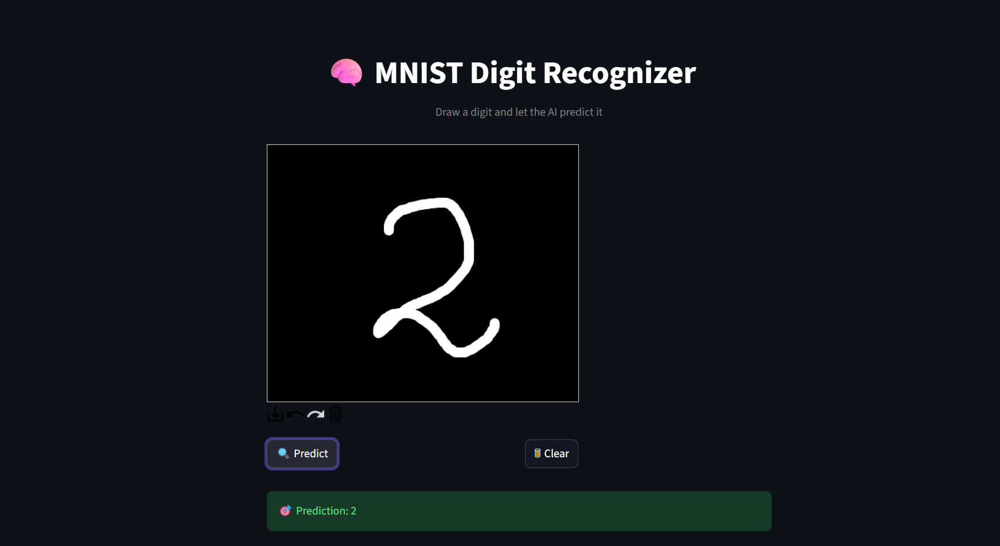

# MNIST Digit Recognizer (Streamlit)

A deep learning web app where users can draw digits and get real-time predictions using a PyTorch model trained on MNIST.

## 📸 Demo


## 🚀 Features
- Draw digit on canvas
- AI prediction
- Confidence visualization
- Dark themed UI

## 🛠 Tech Stack
- Python
- PyTorch
- Streamlit

## ▶ Run Locally

```bash
pip install -r requirements.txt
streamlit run app.py
